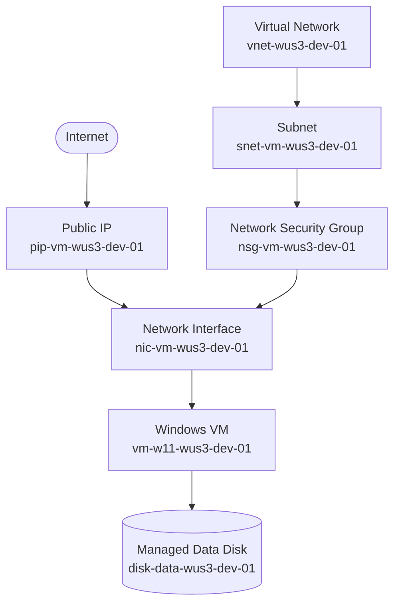

# Arquitectura de recursos

El siguiente diagrama muestra las relaciones principales entre los recursos de red, cómputo y almacenamiento:

El NSG protege la subnet y permite el acceso RDP configurado. La NIC conecta la máquina virtual con la subnet y con la IP pública, mientras que el disco administrado proporciona almacenamiento de datos adicional.
